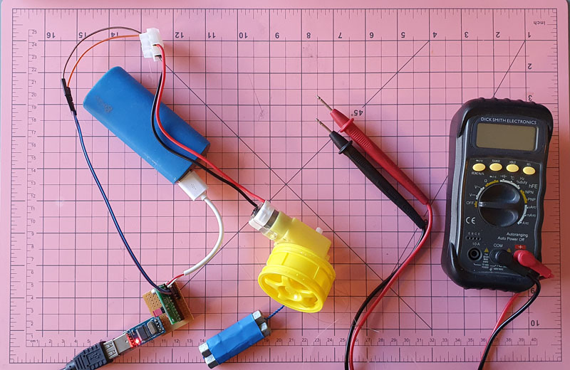
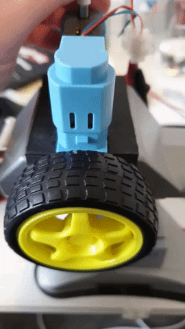

# Some DC motor theory

For a DC motor receiving a rated voltage:

 - It will have a Stall Torque, and a rated (no-load) RPM
 - Torque reduces linearly from the Stall Torque at zero RPM to zero at the rated RPM
 - The peak power is at 1/2 of the Stall Torque - which is the same point as half the rated RPM

https://nrsyed.com/2018/01/21/how-to-read-a-dc-motor-datasheet/

That means you can estimate peak power by calculating the power with inputs of
1/2 the Stall Torque and 1/2 the rated no-load RPM.

## Units/constants

### fRPM

This is not a real unit, but I'm using it to make the formulas clearer to
understand - it is the RPM of the motor.

### P = Power (Watts)

### τ = Torque (Nm)

Can be calculated from kgf.cm using: τ = (kgf.cm * g) / 100

Can be converted to kgf.cm using: kgf.cm = (τ * 100) / g

### ω = Angular Velocity (Radians/second)

Can be calculated from RPM using: ω = 2π * (fRPM / 60)

### g = Gravity

9.80665

## Formulas

### P = τ * ω

Power from torque and angular velocity

### Estimated power

Populating from above components:

P = (τstall / 2) * ((2π * (fRPM / 60)) / 2)

Simplified:

P = (π * fRPM * τstall) / 120

#### Example

https://littlebird.com.au/products/brushless-dc-motor-with-encoder-12v-159rpm?x=786402

Motor rated speed (fRPM): 7100-7300rpm (I'll use 7200)
Blocking (stall) torque (τstall): 2.4kgf.cm (which is 0.2353596 Nm)

P = (π * fRPM * τstall) / 120
  = (π * 7200 * 0.2353596) / 120
  = 44.36 Watts @ 12V @ 3600 RPM

## Experiments in measuring comparable motor performance

###  stall_torque_calculator.py - measuring stall torque per volt

The idea is to ramp voltage until a weight starts to lift, then slow down
until it stops lifting, measure the voltage and use the mass and lifting wheel
diameter to determine the applied torque when it stalled.

Stall torque increases with voltage, fairly linearly, so we can apply the
ratio of the stall torque and voltage to estimate a stall torque per a spec
sheet volt value to compare motors by even if the voltage at which their stall
torque is specified at differs.

#### DG01D-A130GEARMOTOR

This motor + gearbox is spec'd to be 0.8kgf.cm @ 4.5V. As a ratio that is
0.17778 kgf.cm/V.

pipenv run python stall_torque_calculator.py --qik

    Mass of weight in kilograms (0.052):
    Wheel diameter in metres (0.0479):
    Supply voltage (5): 5.1
    Press [Enter] to begin...
    Press [Enter] when the motor starts!
    Press [Enter] when the motor stops!
    0.01Nm (0.12kgf.cm) @ 0.92V => 0.01328Nm/V (0.1354kgf.cm/V)

This is quite different to spec, but I think that the voltage was too far away
from the nominal, and more weight seems to improve the accuracy:

pipenv run python stall_torque_calculator.py --qik

    Mass of weight in kilograms (0.052): 0.16
    Wheel diameter in metres (0.0479):
    Supply voltage (5): 5.1
    Press [Enter] to begin...
    Press [Enter] when the motor starts!
    Press [Enter] when the motor stops!
    0.04Nm (0.38kgf.cm) @ 2.00V => 0.01879Nm/V (0.1916kgf.cm/V)

pipenv run python stall_torque_calculator.py --qik

    Mass of weight in kilograms (0.052): 0.284
    Wheel diameter in metres (0.0479):
    Supply voltage (5): 5.1
    Press [Enter] to begin...
    Press [Enter] when the motor starts!
    Press [Enter] when the motor stops!
    0.07Nm (0.68kgf.cm) @ 3.44V => 0.01939Nm/V (0.1977kgf.cm/V)

These two results are very close, despite a (~75% increase in weight), and
their average (0.19465) is pretty accurate, because 0.19465 * 4.5V =
0.875925kgf.cm and, as above, the spec says the stall torque is 0.8kgf.cm at
4.5V for this motor.

I think there is potential in this technique of estimating comparable stall
torque between different tested motors and spec sheets, as long as the stall
voltages are reasonable close.

#### DG01D-E

pipenv run python stall_torque_calculator.py --qik

    Mass of weight in kilograms (0.052):
    Wheel diameter in metres (0.0479):
    Supply voltage (5): 5.1
    Press [Enter] to begin...
    Press [Enter] when the motor starts!
    Press [Enter] when the motor stops!
    0.01Nm (0.12kgf.cm) @ 1.88V => 0.00650Nm/V (0.0662kgf.cm/V)

pipenv run python stall_torque_calculator.py --qik

    Mass of weight in kilograms (0.052): 0.09
    Wheel diameter in metres (0.0479):
    Supply voltage (5): 5.1
    Press [Enter] to begin...
    Press [Enter] when the motor starts!
    Press [Enter] when the motor stops!
    0.02Nm (0.22kgf.cm) @ 2.68V => 0.00789Nm/V (0.0804kgf.cm/V)

pipenv run python stall_torque_calculator.py --qik

    Mass of weight in kilograms (0.052): 0.162
    Wheel diameter in metres (0.0479):
    Supply voltage (5): 5.1
    Press [Enter] to begin...
    Press [Enter] when the motor starts!
    Press [Enter] when the motor stops!
    0.04Nm (0.39kgf.cm) @ 4.18V => 0.00910Nm/V (0.0928kgf.cm/V)

This backed up some of the results I had before, though the motor is soo weak
I had to use lower weights. On pure comparison though, the DG01D-E is has a
50% lower stall torque compared to the DG01D-A130GEARMOTOR. The below
measurements show it as having 1/3 of the power. No wonder it's not working
for V3 of this robot.

### tester.py - measuring motor power

This is a little simpler. By lifting a known weight a known distance over a
known time, using a known voltage, you can calculate the power in Watts of a
motor.

#### DG01D-A130GEARMOTOR

py tester.py

    Mass of weight in kilograms (0.05):
    Wheel diameter in metres (0.0665):
    Wheel rotations (2):
    Duration of lift in seconds: 0.65
    Battery voltage (5):
    0.02Nm (0.17kgf.cm) & 0.32W @ 5.0V & 184.62RPM

#### DG01D-E

py tester.py

    Mass of weight in kilograms (0.05):
    Wheel diameter in metres (0.0665):
    Wheel rotations (2): 1
    Duration of lift in seconds: 0.9666666666666667
    Battery voltage (5):
    0.02Nm (0.17kgf.cm) & 0.11W @ 5.0V & 62.07RPM
