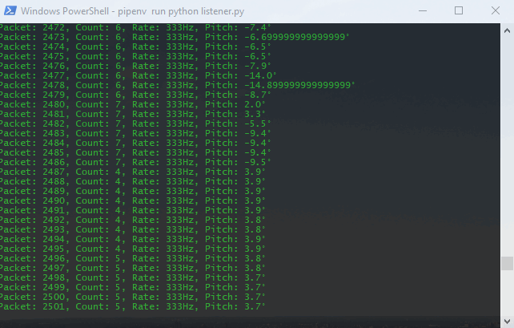
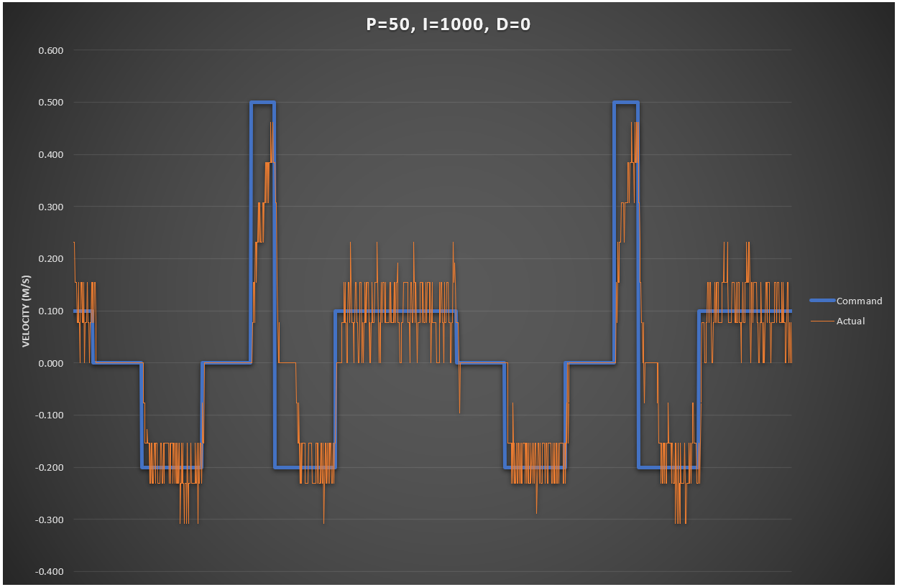
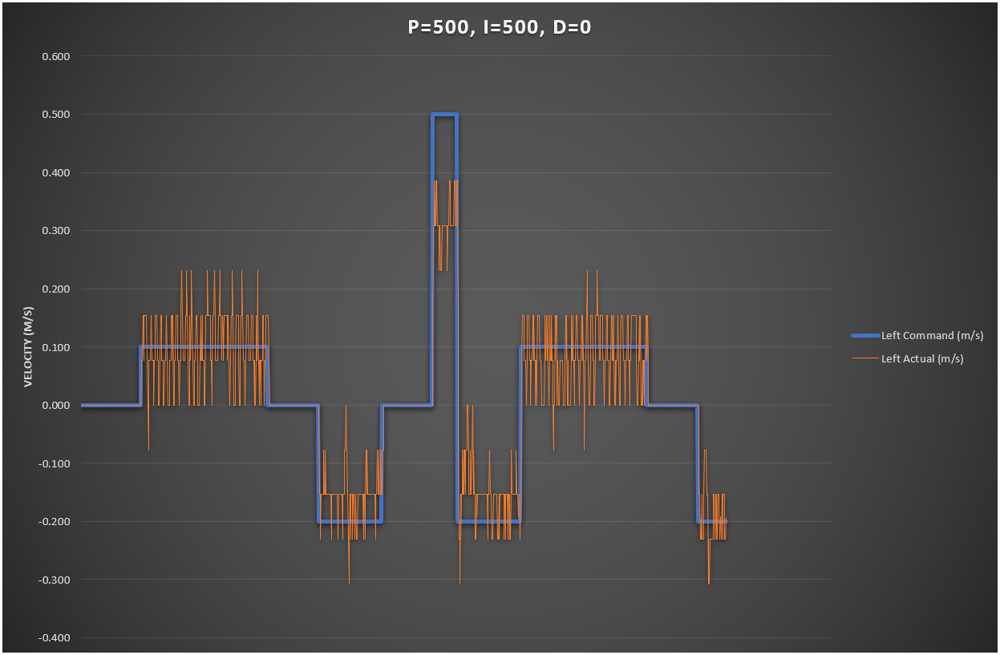

# Telemetry Listener

Prints out telemetry from the robot, received over UDP.

## PID tuning

An example application is the closed-loop motor control tuning I did using
data from the listener:

## Install

    pip install pipenv
    pipenv install

## Run

    pipenv run python listener.py
